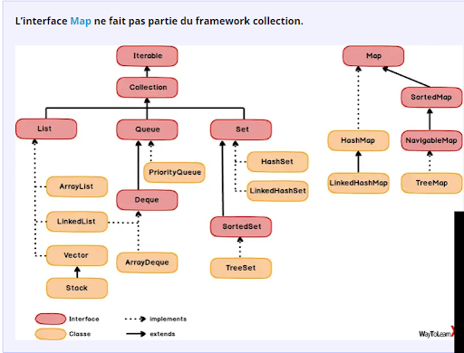
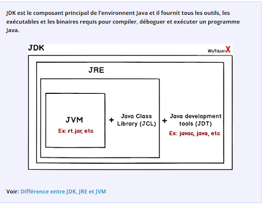

**Coding Test**  

Table of Contents
- [Conception](#conception)
- [Code-Question](#code-question)
  - [palindrome](#palindrome)
  - [three-number-product](#three-number-product)
  - [max-value](#max-value)
  - [factorial](#factorial)
  - [deep-copy-and-shallow-copy](#deep-copy-and-shallow-copy)
  - [warehouse-shipping](#warehouse-shipping)
  - [string-comparison-equals](#string-comparison-equals)
  - [exception-handling](#exception-handling)
  - [2d-array-hourglass-sum](#2d-array-hourglass-sum)
### Conception
Java知识点

1. 线程和多线程
   - Java中的多线程可以通过继承 Thread 类、实现 Runnable 接口或使用 ExecutorService 框架来实现。
   -  `extends` Thread类来创建新线程是不被推荐的。

2. 类加载器和反射
   - 类加载器（`ClassLoader`）用于动态加载类的组件。
   - 反射（Reflection）是指在运行时检查和修改类和对象的结构,允许在运行时动态加载和卸载类。

3. 泛型
   - 泛型（Generics）用于实现类型安全的容器和算法。Example `List<T>`

4. CompletableFuture
   - `CompletableFuture` 用于处理异步操作和组合。

5. 并发集合
   - `ConcurrentHashMap` 是线程安全的并发集合。

6. 接口
   - 接口不能被继承，它定义了一组要由实现类实现的方法。
   - 接口中的方法默认是抽象方法，也就是没有方法体的方法。
   - 可以在接口中使用默认方法（`default method`）和静态方法（`static method`）来提供具体的方法实现。
   - 接口的变量是`public static final`
7. Functional interface
   - 函数式接口只能包含一个抽象方法, 不包含变量。
   - 可以有默认方法和静态方法
8. hashCode 和 HashSet
   - `hashCode()` 方法用于获取哈希码，返回一个int整数, 用于确定对象在哈希表中的索引位置。
   - 在 HashSet 中，hashCode 用于检查重复元素。
   - 如果两个对象具有相同的 hashCode，然后使用 equals() 方法来检查它们是否真的相同。
   - 但不同对象也可以具有相同的哈希码，这种情况称为哈希冲突。

9.  数组和列表
   - 数组的最大值和最小值可以使用 Java 8 的 Stream API 进行查找。
   - 数组可以使用 `Arrays.sort()` 进行排序，也可以使用 `Arrays.sort(arraytab, Collections.reverseOrder())` 进行降序排序。
   -  Collection 接口 `Collections.sort(colt)`;
   - List 是一个有序的集合，元素可重复。Set 是无序唯一的。
   - 在 List 中，使用 add() 方法来添加元素，`add(int index, E element)`可以在指定位置插入元素。
10. `lambda`  (parameter_list) -> expression_or_statement
11. `synchronized` 关键字
    - 用于实现同步，以确保多个线程不会同时访问共享的资源，从而避免竞态条件和数据不一致性。
    - 方法级别 `public synchronized void Method()`,当使用同步方法时，实际上在获取这个对象的锁，锁是实例级别的。
    - 代码块级别使用 `synchronized` 来保护临界区域，使其成为同一时间只能被一个线程执行的部分。`synchronized (lockObject) {}`
12. 抽象类与接口
    - interface: To implement a contract by multiple unrelated objects
    - abstract class: To implement the same or different behavior among multiple related objects
13. array -> List: `List<String> list = Arrays.asList(strArr)`
14. `java.util.Optional<T>`
    - java.util.Optional<T> 提供了一组方法，用于安全地操作可能为空的值
    - `ofNullable(T value)`：创建一个包含可能为空值的 Optional 对象。如果传递的值为 null，则创建一个空 Optional。
    - `empty()`：创建一个空的 Optional 对象，表示值不存在。
    - `isPresent()`：检查 Optional 中是否存在非空值，返回 true 如果存在，否则返回 false。

15. Immutable string
    -  Java 中一旦创建了字符串对象`String` 类，它的内容就不能被修改。对字符串进行的任何操作都会返回一个新的字符串对象。
       -  String str1 = "BOB";，这种方式会在字符串常量池中创建字符串对象。如果已经存在相同内容的字符串对象，就会重用它。
       -  使用new关键字创建字符串对象：例如，String str2 = new String("BOB");，这种方式会在堆内存中创建一个新的字符串对象，无论是否存在相同内容的字符串对象。


15. Exception and Error
    - 异常通常表示程序运行时遇到的问题，这些问题可以被程序处理并继续执行。异常通常是非致命性的，即它们不会导致程序崩溃
      - Checked Exception 编译时强制检查的异常
      - Unchecked Exception 运行时异常 (RuntimeException),ex: `NullPointerException`
    - 错误通常表示严重问题，程序无法处理或恢复。通常是致命性的，即它们会导致程序崩溃或无法继续执行。例如，内存不足错误（OutOfMemoryError）
16. Exception Handling from another thread
    - 主线程和子线程有独立的异常处理机制
    - `Thread` 类的 `setUncaughtExceptionHandler` 方法为子线程设置未捕获异常处理器

17. Java 版本更新问题 Java 内存储存问题 Java 的回收机制

18. Collection and Map  

19. jdk jre jvm  

### Code-Question
#### palindrome

Code une fonction, dans le langage de ton choix, qui détermine si la chaîne S est un palindrome. Un palindrome est un mot ou une phrase qui peut se lire dans les 2 sens (exemples : "elle", "radar", "mon nom").

```javascript
function isPalindrome(str) {
    str = str.replace(/ /g, '').toLowerCase();
    return str === str.split('').reverse().join('');
}
str = 'ad  da'
console.log(isPalindrome(str))
```
#### three-number-product

Code une fonction, dans le langage de ton choix, qui détermine s'il existe 3 entiers dont le produit fait 30 dans le tableau T.

```javascript
function hasProduct30(arr) {
    // Sort the array in ascending order
    arr.sort((a, b) => a - b);

    // Check if there are three elements whose product is 30
    for (let i = 0; i < arr.length - 2; i++) {
        for (let j = i + 1; j < arr.length - 1; j++) {
            for (let k = j + 1; k < arr.length; k++) {
                if (arr[i] * arr[j] * arr[k] === 30) {
                    return true;
                }
            }
        }
    }
    return false;
}

// Example of usage
const array = [6, 85, 2, 5];
if (hasProduct30(array)) {
    console.log("There are three integers in the array whose product is 30.");
} else {
    console.log("No combination of three integers in the array results in a product of 30.");
}
```

#### max-value

```javascript
function findMaxInArr(arr){
    if(arr.length === 0){
        return null
    }
    let int = arr[0]
    for(let i = 0; i < arr.length; i++){
        if (arr[i] > int){
            int = arr[i]
        }
    }
    return int   
}
```

```java
//java
//使用Collections.max()方法（适用于List）：
List<Integer> numbers = Arrays.asList(1, 2, 3, 4, 5);
int max = Collections.max(numbers);
//使用数组的Arrays类中的stream和max：
int[] numbers = {1, 2, 3, 4, 5};
int max = Arrays.stream(numbers).max().getAsInt();
```
#### factorial

You need to find the Crazy Factorial of a given number n. It means after computing the factorial of n, the result will be divided by Sum of the Digits in the number.

Example: n = 5

1. 计算 n 的阶乘：$5! = 5 \times 4 \times 3 \times 2 \times 1 = 120$

2. 将阶乘结果分解成各个数字：$120$ 由数字 $1, 2, 0$ 组成。

3. 计算数字的和：$1 + 2 + 0 = 3$

4. 用和来除以 3：$3 / 3 = 1$

所以，Crazy Factorial of 5 是 1。
```java
public class CrazyFactorial {
    public static long calculateFactorial(int n){
        long factorial = 1;
        for (int i = 1; i <= n; i++){
            factorial *= i;
        };
        return factorial;
    }
    public static long calculateDigitSum(long number){
        long digitSum = 0;
        long temp = number;
        while(temp > 0){
            digitSum += temp % 10;
            temp /= 10;
        }
        return digitSum;
    }
    public static long calculateCrazyFactorial(long factorial, long digitSum){
        if(digitSum == 0){
            return 0;
        } else {
            return factorial / digitSum;
        }
    }
}
```
#### deep-copy-and-shallow-copy

Modify the body of some methods (this can include the body of the constructor) to protect Person instances against alteration: Once a Person is created,  it should not be possible to modify.
```java
class Person {
    private String name:
    private Date birthDate:
    //Creates a Person with the given name and birth date.
    public Person (String name, Date birthDate) {
      this.name = name;
      this.birthDate = birthDate;
    }

    public String getName() { return name;}
    public Date getBirthDate(){
      return birthDate;
    }
}
```
Solution
```java
public final class Person {
    private final String name;
    private final Date birthDate;

    // Creates a Person with the given name and birth date.
    public Person(String name, Date birthDate) {
        this.name = name;
        this.birthDate = new Date(birthDate.getTime()); // Create a defensive copy
    }

    public String getName() {
        return name;
    }

    public Date getBirthDate() {
        return new Date(birthDate.getTime()); // Return a defensive copy
    }
}
```
#### warehouse-shipping

Implémentez la méthode WarehouseManager. prepareShipping(Box| listOfAIlBoxes, int weight Limit) afin qu'elle retourne la liste de boîtes la plus grande possible dans la limite de poids total indiqué.

Pour choisir les boites à livrer, on prend d'abord les plus grandes puis, parmi les boîtes de même taille, les plus légères.

Note :
- la fonction renverra toujours une liste, même si elle est vide.
- le paramètre boxes ne sera jamais null.

```javascript
import java.util.*;

class WarehouseManager {
    /**
     * Prepare a shipping.
     * Deliver the largest size of boxes first.
     * Then deliver lighter boxes.
     * As many boxes as possible, within the defined weight limit.
     *
     * @param listOfAllBoxes is an array of boxes.
     * @param weightLimit is the maximum sum of weight to be returned.
     *
     * @return a shipping list of ordered boxes so that the sum of weight is less than or equal to the given weight limit.
     */
    List<Box> prepareShipping(Box[] listOfAllBoxes, int weightLimit) {
        // Sort the boxes by size (largest first) and weight (lightest first).
        return null;
    }
}

class Box {
    int boxNumber;
    Size size;
    int weight;

    static int id = 0;

    static Box of(Size size, int weight) {
        Box box = new Box();
        box.size = size;
        box.weight = weight;
        box.boxNumber = id++;
        return box;
    }
}

enum Size {SMALL, MEDIUM, LARGE, EXTRA_LARGE}
```
#### string-comparison-equals

A.isFoo(String param) should return true if param is equal to the string "foo" , false otherwise. Implement A.isFoo(String param). 
```java
str.equals( "foo");
```
#### exception-handling

Update the code by implementing the following rules: If an exception is thrown by s.execute() then call c.rollback() and propagate the exception, otherwise call c.commit() In any circumstances, c. close() must be called before leaving the method a(Service s, Connection c).

```java
class A {

    /**
     * Executes the service with the given connection.
     */
    void a(Service s, Connection c) {
        // Ideally, the connection implementations should implement AutoClosable
        s.setConnection(c);
        try {
            s.execute();
            c.commit();
        } catch (Exception e) {
            c.rollback();
            throw e; // Propagate the exception
        } finally {
            c.close();
        }
    }
}

interface Service {
    void execute() throws Exception;
    void setConnection(Connection c);
}

interface Connection {
    void commit();
    void rollback();
    void close();
}

```


#### 2d-array-hourglass-sum

You are given a 6x6 2D array. An hourglass in an array is a portion shaped like this:

```
a b c
  d
e f g
```

For example, if we create an hourglass using the number 1 within an array full of zeros, it may look like this:

```
1 1 1 0 0 0
0 1 0 0 0 0
1 1 1 0 0 0
0 0 2 4 4 0
0 0 0 2 0 0
0 0 1 2 4 0
```
```
1 1 1     1 1 0     1 0 0
  1         0         0
1 1 1     1 1 0     1 0 0
```
The sum of an hourglass is the sum of all the numbers within it. The sum for the hourglasses above are 7, 4, and 2, respectively.

You are required to find and print the largest sum among all the hourglasses in the given 2D array.

- Input Format

The input consists of 6 lines, each containing 6 integers separated by spaces. Each integer will be between 0 and 9, inclusive.

- Output Format

Print the answer to this problem on a single line.

- Sample Input

```
1 1 1 0 0 0
0 1 0 0 0 0
1 1 1 0 0 0
0 0 2 4 4 0
0 0 0 2 0 0
0 0 1 2 4 0
```
- Sample Output

```
19
```

The hourglass that has the largest sum is:

```
2 4 4
  2
1 2 4
```

The sum of this hourglass is 19.

```java
public class Solution {
    public static void main(String[] args) throws IOException {
        BufferedReader bufferedReader = new BufferedRea(new InputStreamReader(System.in));

        List<List<Integer>> arr = new ArrayList<>();

        for (int i = 0; i < 6; i++) {
            String[] arrRowTempItems = bufferedReader.readLine().replaceAll("\\s+$", "").split(" ");

            List<Integer> arrRowItems = new ArrayList<>();

            for (int j = 0; j < 6; j++) {
                int arrItem = Integer.parseInt(arrRowTempItems[j]);
                arrRowItems.add(arrItem);
            }

            arr.add(arrRowItems);
        }

     
        int maxSum = Integer.MIN_VALUE;

       
        for (int i = 0; i < 4; i++) {
            for (int j = 0; j < 4; j++) {
                // Calculate the sum of the current hourglass
                int currentSum = arr.get(i).get(j) + arr.get(i).get(j + 1) + arr.get(i).get(j + 2) +
                                arr.get(i + 1).get(j + 1) +
                                arr.get(i + 2).get(j) + arr.get(i + 2).get(j + 1) + arr.get(i + 2).get(j + 2);

                // Update the maximum sum if the current sum is larger
                if (currentSum > maxSum) {
                    maxSum = currentSum;
                }
            }
        }

        // Print the maximum sum
        System.out.println(maxSum);

        bufferedReader.close();
    }
}
```